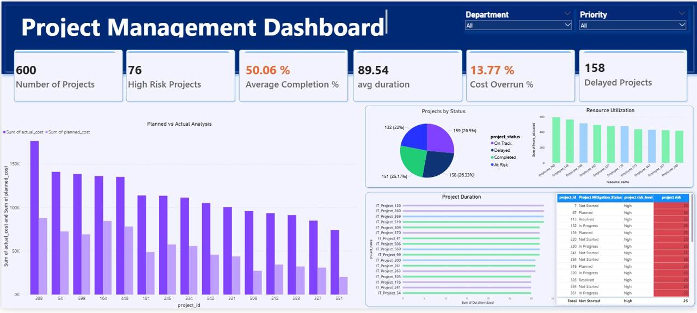

# Project Management Dashboard – Power BI

This academic project involved developing an interactive Project Management Dashboard using Power BI to monitor and analyze project performance.

The dashboard provides insights into project status, completion rates, project duration, risks, costs, delays, and resource utilization through KPIs and interactive visualizations.

## My Contribution

- Selected and prepared the project management data for analysis.
- Cleaned and transformed the datasets in Power BI.
- Created relationships between multiple datasets.
- Developed the dashboard visualizations and analytical views, excluding the KPI cards.
- Contributed to the overall dashboard design and organization.

## Dashboard Overview

The dashboard provides visual insights into project status, planned vs. actual performance, project duration, resource utilization, and other project management metrics.

